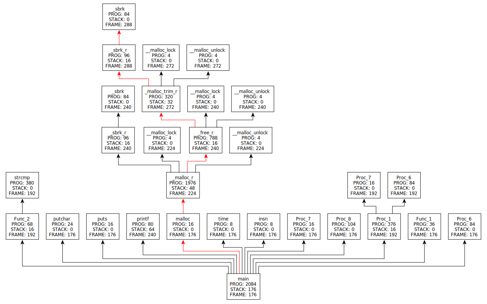
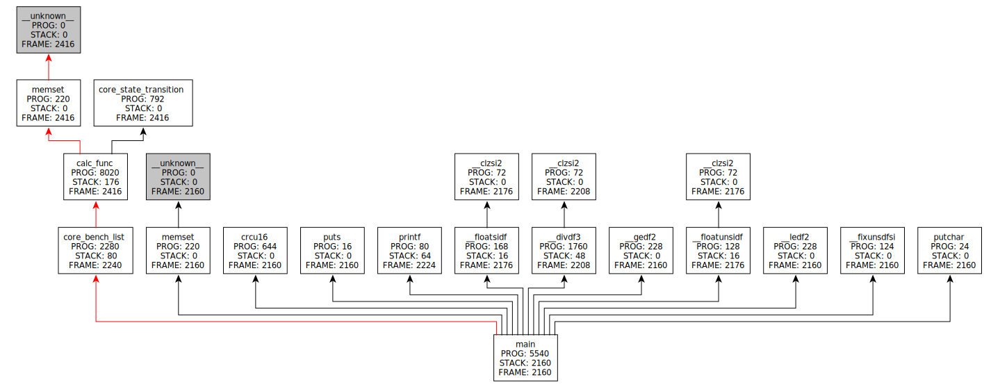
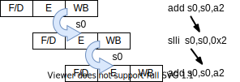
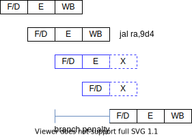

# SRV32 - Simple 3-stage pipeline RISC-V processor

[](https://www.codacy.com/manual/kuopinghsu/srv32/dashboard?utm_source=github.com&amp;utm_medium=referral&amp;utm_content=kuopinghsu/srv32&amp;utm_campaign=Badge_Grade)

This is a simple RISC-V 3-stage pipeline processor and supports FreeRTOS.
I wrote this code to understand the RV32IM instruction set, just for fun.
The performance is 1.959 DMIPS/MHz and 3.270 Coremark/MHz.
This is not a RISC-V core available for production.

## Features

1.  Three-stage pipeline processor
2.  RV32IM/RV32E instruction sets
3.  Pass RV32IM [architecture test](https://github.com/riscv-non-isa/riscv-arch-test)
4.  Trap exception
5.  Interrupt handler
6.  [FreeRTOS](https://github.com/kuopinghsu/FreeRTOS-RISCV) support
7.  ISS simulator

## Building toolchains

Install RISCV toolchains.

    # Ubuntu packages needed:
    sudo apt-get install autoconf automake autotools-dev curl libmpc-dev \
        libmpfr-dev libgmp-dev gawk build-essential bison flex texinfo \
        gperf libtool patchutils bc zlib1g-dev git libexpat1-dev python3 \
        python-is-python3 lcov
    
    git clone --recursive https://github.com/riscv/riscv-gnu-toolchain
    cd riscv-gnu-toolchain

    mkdir build; cd build

    ../configure --prefix=/opt/riscv \
       --with-isa-spec=20191213 \
       --with-multilib-generator="\
         rv32i_zicsr-ilp32--;\
         rv32im_zicsr-ilp32--;\
         rv32imac_zicsr-ilp32--;\
         rv32i_zicsr_zba_zbb_zbc_zbs-ilp32--;\
         rv32im_zicsr_zba_zbb_zbc_zbs-ilp32--;\
         rv32imac_zicsr_zba_zbb_zbc_zbs-ilp32--;\
         rv32e_zicsr-ilp32e--;\
         rv32em_zicsr-ilp32e--;\
         rv32emac_zicsr-ilp32e--;\
         rv64gc_zicsr-lp64--;\
         rv64gc_zicsr_zba_zbb_zbc_zbs-lp64--"

    make -j$(nproc)

Note: change the default ISA to 20191213, refer to [RISC-V GNU toolchain bumping default ISA spec to 20191213](https://groups.google.com/a/groups.riscv.org/g/sw-dev/c/aE1ZeHHCYf4) for detail.

Note: To build the Zba/Zbb/Zbc/Zbs extension, you must use the gcc-13 branch or latter, otherwise a build error will occur. Or if the B extension is not used, remove the corresponding multilib.

The default tools uses riscv64-unknown-elf-. If you would like to use others toolchains, you can define an environment to override it. For example,

    export CROSS_COMPILE=riscv-none-elf-

Therefore, you can use [The xPack GNU RISC-V Embedded GCC](https://github.com/xpack-dev-tools/riscv-none-elf-gcc-xpack) instead of building a toolchain yourself.
It has been changed to default ISA spec to 20192013, but it does not include rv32im_zicsr multlib.
The workaround is using -misa-spec=2.2 to force RISC-V GCC using the older ISA spec version.
Adding extra CFLAGS as follows.

    export EXTRA_CFLAGS="-misa-spec=2.2 -march=rv32im"


## Files list

| Folder    | Description                                     |
| --------- | ----------------------------------------------- |
| coverage  | Code coverage report                            |
| doc       | Instruction set document                        |
| rtl       | RTL files                                       |
| sim       | Icarus Verilog/Verilator simulation environment |
| sw        | Benchmark, diags ... etc.                       |
| syn       | Synthesis environment for Yosys                 |
| tests     | Compliance tests                                |
| testbench | testbench, memory model                         |
| tool      | ISS (instruction set simulator)                 |

## RTL Simulation

Support Verilator (default) and Icarus Verilog.

To run Verilator,

    # Ubuntu package needed to run the RTL simulation
    sudo apt install verilator
    
    # Modify the Makefile, and set verilator ?= 1
    vim sim/Makefile
    or
    make verilator=1

To run Icarus Verilog,

    # Ubuntu package needed to run the RTL simulation
    sudo apt install iverilog
    
    # Modify the Makefile, and set verilator ?= 0
    vim sim/Makefile
    or
    make verilator=0

Only running make without parameters will get help.

    $ make
    make all         build all diags and run the RTL sim
    make all-sw      build all diags and run the ISS sim
    make tests-all   run all diags and compliance test
    make coverage    generate code coverage report
    make build       build all diags and the RTL
    make dhrystone   build Dhrystone diag and run the RTL sim
    make coremark    build Coremark diag and run the RTL sim
    make clean       clean
    make distclean   clean all

    rv32c=1          enable RV32C (default off)
    rv32e=1          enable RV32E (default off)
    debug=1          enable waveform dump (default off)
    coverage=1       enable coverage test (default off)
    test_v=[1|2]     run test compliance v1 or v2 (default)

    For example

    make tests-all             run all tests with test compliance v1
    make test_v=2 tests-all    run all tests with test compliance v2
    make coverage=1 tests-all  run all tests with code coverage report
    make debug=1 hello         run hello with waveform dump
    make rv32e=1 dhrystone     run dhrystone for RV32E config

Supports following parameter when running the simulation.

    +no-meminit do not memory initialize zero
    +dump       dump VCD (Icarus Verilog) / FST (Verilator) file
    +trace      generate tracelog

For example, following command will generate the VCD dump.

    cd sim && ./sim +dump

Use +trace to generate a trace log, which can be compared with the log file of the ISS simulator to ensure that the RTL simulation is correct.

    cd sim && ./sim +trace

## ISS (Instruction Set Simulator)

The rvsim is an instruction set simulator (ISS) that can generate trace logs for comparison with RTL simulation results. It can also set parameters of branch penalty to run benchmarks to see the effect of branch penalty. The branch instructions of hardware is two instructions delay for branch penalties.

    Usage: rvsim [-h] [-b n] [-p] [-l logfile] file

           --help, -h              help
           --branch n, -b n        branch penalty (default 2)
           --predict, -p           static branch prediction
           --log file, -l file     generate log file

           file                    the elf executable file

The ISS simulator and hardware supports RV32IMC instruction sets. (RV32C is disabled by default to pass conformance test v1)

## Benchmarks

This is the RV32IM simulation result in GCC13.

### Dhrystone

The call tree generated by [graphgen](https://github.com/kuopinghsu/callgraph-gen).



> Generated by command 'graphgen -t -r main -i printf,puts,putchar dhrystone.dis'

```
Dhrystone Benchmark, Version 2.1 (Language: C)

Program compiled without 'register' attribute

Please give the number of runs through the benchmark:
Execution starts, 100 runs through Dhrystone
Execution ends

Final values of the variables used in the benchmark:

Int_Glob:            5
        should be:   5
Bool_Glob:           1
        should be:   1
Ch_1_Glob:           A
        should be:   A
Ch_2_Glob:           B
        should be:   B
Arr_1_Glob[8]:       7
        should be:   7
Arr_2_Glob[8][7]:    110
        should be:   Number_Of_Runs + 10
Ptr_Glob->
  Ptr_Comp:          147096
        should be:   (implementation-dependent)
  Discr:             0
        should be:   0
  Enum_Comp:         2
        should be:   2
  Int_Comp:          17
        should be:   17
  Str_Comp:          DHRYSTONE PROGRAM, SOME STRING
        should be:   DHRYSTONE PROGRAM, SOME STRING
Next_Ptr_Glob->
  Ptr_Comp:          147096
        should be:   (implementation-dependent), same as above
  Discr:             0
        should be:   0
  Enum_Comp:         1
        should be:   1
  Int_Comp:          18
        should be:   18
  Str_Comp:          DHRYSTONE PROGRAM, SOME STRING
        should be:   DHRYSTONE PROGRAM, SOME STRING
Int_1_Loc:           5
        should be:   5
Int_2_Loc:           13
        should be:   13
Int_3_Loc:           7
        should be:   7
Enum_Loc:            1
        should be:   1
Str_1_Loc:           DHRYSTONE PROGRAM, 1'ST STRING
        should be:   DHRYSTONE PROGRAM, 1'ST STRING
Str_2_Loc:           DHRYSTONE PROGRAM, 2'ND STRING
        should be:   DHRYSTONE PROGRAM, 2'ND STRING

Number_Of_Runs: 100
User_Time: 29242 cycles, 24436 insn
Cycles_Per_Instruction: 1.196
Dhrystones_Per_Second_Per_MHz: 3419
DMIPS_Per_MHz: 1.945

Excuting 95582 instructions, 126140 cycles, 1.320 CPI
Program terminate

Simulation statistics
=====================
Simulation time  : 0.024 s
Simulation cycles: 126140
Simulation speed : 5.228 MHz
```

### Coremark

The call tree generated by [graphgen](https://github.com/kuopinghsu/callgraph-gen).



> Generated by command 'graphgen -t -r main -i printf,puts,putchar coremark.dis'

```
2K performance run parameters for coremark.
CoreMark Size    : 666
Total ticks      : 1261784
Total time (secs): 0.012618
Iterations/Sec   : 317.011469
Iterations       : 4
Compiler version : GCC13.2.0
Compiler flags   : -O3 -march=rv32im_zicsr -mabi=ilp32  -nostartfiles -L../common -DPERFORMANCE_RUN=1 -fno-common -funroll-loops -finline-functions -falign-functions=16 -falign-jumps=4 -falign-loops=4 -finline-limit=1000 -fno-tree-sink -fgcse-sm -fno-strict-overflow   -lsys -T ../common/default.ld
Memory location  : STACK
seedcrc          : 0xe9f5
[0]crclist       : 0xe714
[0]crcmatrix     : 0x1fd7
[0]crcstate      : 0x8e3a
[0]crcfinal      : 0x9f95
Correct operation validated. See README.md for run and reporting rules.
CoreMark 1.0 : 317.011469 / GCC13.2.0 -O3 -march=rv32im_zicsr -mabi=ilp32  -nostartfiles -L../common -DPERFORMANCE_RUN=1 -fno-common -funroll-loops -finline-functions -falign-functions=16 -falign-jumps=4 -falign-loops=4 -finline-limit=1000 -fno-tree-sink -fgcse-sm -fno-strict-overflow   -lsys -T ../common/default.ld / STACK
CoreMark/MHz: 3.170115

Excuting 1105991 instructions, 1340783 cycles, 1.212 CPI
Program terminate

Simulation statistics
=====================
Simulation time  : 0.188 s
Simulation cycles: 1340783
Simulation speed : 7.129 MHz
```

> Note: Coremark requires a total time of more than 10 seconds, but this will result in a longer simulation time. This Coremark value provides a reference when the iteration is 4.

### Benchmark with different configurations

| Name      | GCC11 RV32IM                    | GCC11 RV32IM (*1)               | GCC11 RV32IM (*2)              |
|-----------| ------------------------------- | ------------------------------- | ------------------------------ |
| Dhrystone | 1.821 DMIPS/MHz<br>1.298 CPI    | 1.844 DMIPS/MHz<br>1.158 CPI    | 2.151 DMIPS/MHz<br>1.000 CPI   |
| Coremark  | 3.120 Coremark/MHz<br>1.238 CPI | 3.470 Coremark/MHz<br>1.102 CPI | 3.815 Coremark/MHz<br>1.000CPI |

> Note 1: this is a measurement made by ISS simulator for GCC11 with static branch prediction.

> Note 2: this is a measurement made by ISS simulator for GCC11 with no branch penalty. This is the best case for single issue and in order execution on RV32IM. The 1.0 CPI is the upper limit of optimal performance.

> Note 3: After using LTO (Link Time Optimization), Dhrystone scored an unreasonable score of 3.759 DMIPS/MHz on GCC11 RV32IM. To make the benchmark reasonable, I did not use the -flto option. If the -flto option is used, the score will be higher.

### Benchmark with different GCC versions

| Benchmark    | gcc-8.3 | gcc-9.2 | gcc-10.2 | gcc-11.1 | gcc-12.1 | gcc-13.2 | gcc-13.2* |
|--------------| --------|---------|----------|----------|----------|----------|-----------|
| DMIPS/MHz    | 1.926   | 1.926   | 1.926    | 1.926    | 1.913    | 1.945    | 1.959     |
| CoreMark/MHz | 2.951   | 2.920   | 2.934    | 3.183    | 3.192    | 3.170    | 3.270     |

> Note 1: compile with Zba_Zbb_Zbc_Zbs extensions

## Cycles per Instruction Performance

Two instructions branch penalty if branch taken, CPI is 1 for other instructions. The average Cycles per Instruction (CPI) is approximately 1.3 on Dhrystone diag.

This core is three-stage pipeline processors, which is Fetch & Decode (F/D), execution (E) and write back (WB).

*   Register Forwarding

The problem with data hazards, introduced by this sequence of instructions can be solved with a simple hardware technique called forwarding. When the execution result accesses the same register, the execution result is directly forwarded to the next instruction.



*   Branch Penalty

When the branch is taken during the execute phase, it needs to flush the instructions that have been fetched into the pipeline, which causes a delay of two instructions, so the extra cost of the branch is two.



## Memory Interface

One instruction memory and one data memory. The instruction memory is read-only for one read port, while data memory is two port, one for reading and one for writing.

## Synthesis

Provide the Yosys synthesis script in the syn folder.

## Architecture tests

Architecture test for ISS simulator and RTL. This is the architecture test form RISC-V Foundation Compliance Task Group.
The github repository is at <https://github.com/riscv-non-isa/riscv-arch-test>. Running the following command will clone the repository into tests folder and do the compliance test.

    make tests              # run the compliance test for RTL
    make tests-sw           # run the compliance test for ISS simulator

Default is to run compliance test v1, run the following command to run compliance test v2.

    make test_v=2 tests     # run the compliance test for RTL
    make test_v=2 tests-sw  # run the compliance test for ISS simulator

Notes: no complicance test for RV32E configuration.

## FreeRTOS support

Reference code on <https://github.com/kuopinghsu/FreeRTOS-RISCV>.

    # build FreeRTOS and demo
    git clone --recursive https://github.com/kuopinghsu/FreeRTOS-RISCV
    cd FreeRTOS-RISCV && make

This is an example to run the "queue" demo.

    # make directory
    mkdir ${path_of_srv32}/sw/queue

    # copy queue.elf
    cp Demo/examples/queue.elf ${path_of_srv32}/sw/queue/.

    # update the example in sw folder
    cd ${path_of_srv32}/sw && make update

    # run the example for RTL and ISS simulator
    cd ${path_of_srv32} && make queue

## Coverage Report

    # Ubuntu package needed to generate coverage report
    sudo apt install lcov

Following command will generate the code coverage report in coverage/html
directory.

    % make coverage

This is the coverage report of RTL by lcov, which get 100% code coverage.


This is the coverage report of ISS.


## Known issues

*   Memory can not respond non-valid, that is, the memory should always accept the command from CPU.

## TO-DO

*   merge the memory interface into one memory for one port
*   static branch predictor
*   support RV32C compress extension
*   serial multiplier and divider
*   Nuttx & Zephyr porting

## License

MIT license
